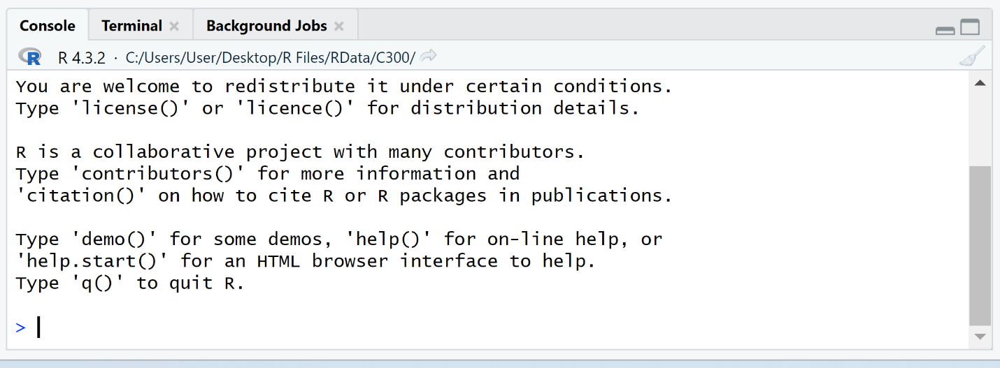
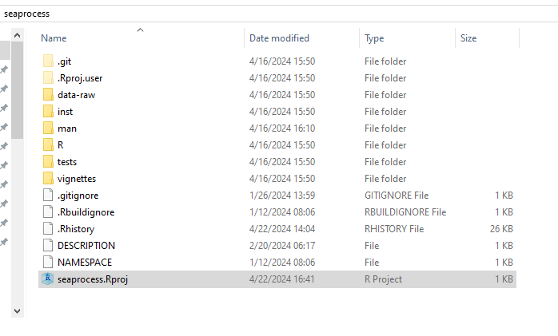
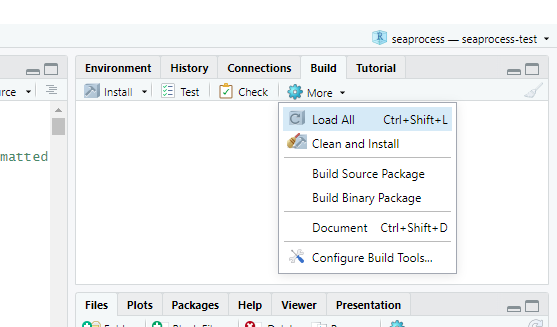

```{r setup, include=FALSE}
knitr::opts_chunk$set(echo = TRUE)
```

\*Note: This describes steps to update *and* install R *and* packages needed for SeaProcess to run. **If updating packages, you only need to worry about the steps that concern packages.**

# Install R and Packages on Windows PC with Internet

## Install R

Follow this link to download the .exe file for the most recent version of R:

<https://cran.r-project.org/bin/windows/base/release.html>

-   Run the .exe file and click yes through the options to update the internet connected computer's version of R. Once complete open Rstudio. {width="500"}
-   Check that RStudio is running the version of R that you just downloaded.
-   If RStudio doesn't automatically open in the version you downloaded, then go to **Tools \> Global Options... \> General \> R Version \> Change...** and select the newest version.

## Download Required Packages

-   The required packages are: tidyverse (readr, ggplot, dplyr, lubridate, purrr, stringr, tidyr, tibble, etc.), oce, readxl, devtools, vegan. Suggested packages: rmarkdown, knitr, kableExtra, sf
-   Or you can just copy and paste the following command:

install.packages(c("oce", "tidyverse", "readxl", "devtools", "vegan", "rmarkdown", "knitr", "kableExtra", "sf"), dependencies = TRUE)

-   Once "devtools" is installed, run the following command to download SeaProcess:

    devtools::install_github("mattbihrle/seaprocess", build_vignettes = T, dependencies = T)

-   Another option to download the package is to go to: [github.com/mattbihrle/seaprocess](http://github.com/mattbihrle/seaprocess) clicking on "\<\>Code" and downloading the zip file.

-   Then you can move the .zip file to labutil and within R Studio run: remotes::install_local(path = "\<path to zip file\>/seaprocess-master.zip", build_vignettes = T)

## Copy .exe and packages to a USB drive or EHD.

Taken from: [https://wikis.utexas.edu/display/coeito/R+Tutorial](https://wikis.utexas.edu/display/coeito/R+Tutorial+-+How+to+Transfer+R+Packages+To+An+Offline+Computer#:~:text=If%20you%20had%20compressed%20the,use%20on%20the%20offline%20computer.)

"- The first thing you need to do is determine what folder on the internet connected R computer contains the installed packages. To do this, execute the"**.libPaths()**" function in R. This will output the directory on the computer that contains all the R packages which you'll need to copy off the computer.

\- Now that you know the directory that contains the R packages, copy the entire directory to a USB drive. Usually the R packages directory contains a lot of files which may take awhile to transfer off the computer. If you are using a Windows computer you can speed things up by right-clicking on the R packages directory and choosing the option **Send to...** \| **Compressed (zipped) folder**. This will compress the entire folder to a single zip file that you can then transfer off the computer."

# Install Updated R On LabUtil

\- Put the USB drive in LabUtil and run the .exe file from the USB following the same steps (Tools \> Global Options ...) to make sure RStudio is running the most updated version of R.

NOTE: If the newer version of R doesn't work, we can always just select the older version in "Global Options" and run that instead.

# Install Updated Packages on LabUtil

Again, taken from [https://wikis.utexas.edu/display/coeito/R+Tutorial](https://wikis.utexas.edu/display/coeito/R+Tutorial+-+How+to+Transfer+R+Packages+To+An+Offline+Computer#:~:text=If%20you%20had%20compressed%20the,use%20on%20the%20offline%20computer.):

"- Insert the USB drive containing the R packages into the offline computer.\
Now you need to determine where to copy the R packages directory to. Start up R on the offline computer and execute the"**.libPaths()**" function. Note the directory returned in the results.

\- Copy the R packages directory from your USB drive to the parent directory of the R packages directory on the offline computer. By doing this and the previous step you are basically replacing the R packages directory of the offline computer with a copy of the R packages directory from the internet connected computer. If you had compressed the packages directory into a single zip file then you'll need to first decompress it and then you can copy the packages "Library" folder within it.

\- At this point the R packages should be installed and ready for use on the offline computer."

# Install or Update SeaProcess

## LabUtil Connected to Internet

Open RStudio, and run the following command:

*devtools::install_github("mattbihrle/seaprocess", build_vignettes = T, dependencies = T)*

## LabUtil Not Connecting to Internet

1.  On a Windows computer, go to "github.com/mattbihrle/seaprocess" and click on "\<\>Code" to download a zip file.
2.  Transfer the .zip file to LabUtil and extract all contents.
3.  Open the .Rproj file within your new directory.

{width="500"}

4.  Once that file is open, click on Build \> More \> build source package

{width="500"}

This will build a package with the file extension .tar.gz in the same directory as the project file you have open. It may show warnings during the build process---that is okay. Errors are not.

5.  Next, within R run the command: *remotes::install_local(path = "\<path_to_tar.gz\>/seaprocess_0.2.0.tar.gz", build_vignettes = T)*
    a.  *Note:* If you want to be sendy and do it all in one step, send the command:install.packages(devtools::build(devtools::build(), binary = T)) which will build the source package, binary package, and install it all in one.
6.  Once the package is installed, be sure to save BOTH the zip file from github and a copy of the tar.gz file in either:
    a.  RCS Science '21\> Scientist Resources \> Computers \> R \> seaprocess .zip files \> "Date new files joined the ship"
    b.  CC Science \> Equipment \> Computers + Network \> R \> SeaProcess .zip files "Date new files joined the ship"

This way you have copy of the package if you need to reinstall it, as well as a .zip file with files that you can edit if needed underway.
