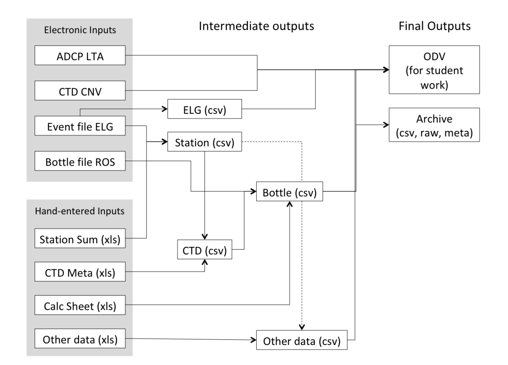
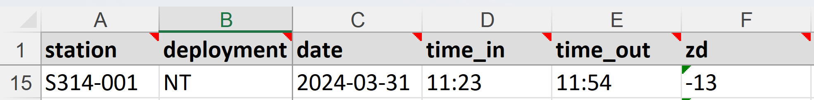
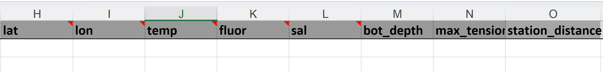

```{r, include = FALSE}
knitr::opts_chunk$set(
  collapse = TRUE,
  comment = "#>"
)
```

```{r setup}
library(seaprocess)
```

# Introduction

This vignette is an overview of the seaprocess package and what it does to process data collected aboard the Sea Education Association's Sailing School Vessels the Corwith Cramer and the Robert C. Seamans.

The goals of this package are to:

-   Provide a robust set of customizable tools that can handle the processing of raw input data to usable and archive data formats
-   To document the process for others interested in how SEA processes it's data
-   To simplify many of SEA's historic data processing routines.



# Processing Philosophy

The processing functions in this package are built such that in theory you *should* be able run a very general command that should take the raw data in any stream and take it all the way through to final output. However, there are always odd data examples in any cruise so built in to the processing routines are ways to initialize these higher level functions to change processing routines at lower levels

For example:

To process elg event files we use the function `process_elg()`. The only thing you have to specify is the location of the folder that contains the elg event files. ie.

```{r, eval = FALSE}
process_elg("data/elg")
```

Under the hood, `process_elg()` is calling:

-   `read_elg_fold()`, which is the actual function that reads a list of elg files from a folder. It loops through all the elg files in a folder and in-tern calls `read_elg()` which is the function that reads individual elg files. `read_elg_fold()` then combines them all in to one data file.

-   `filter_elg()`, which is a function to filter out flow-through data based on a minimum salinity threshold (default 30 psu), or user-defined maximum and minimum values for other flow-through parameters.

-   `average_elg()`, which is a function that averages the data into some time window. This is a little akin to what hourlywork used to do. However, you can specify the averaging window to be any number of minutes.

-   `add_file_cruiseID()`, which adds an optional cruise identifier to output files so that you can keep them organized.

-   `safely_write_csv()`, which writes the averaged data to a comma-separated-value file

-   `format_elg_odv()`, which formats the averaged data so that it can be read into Ocean Data View.

The complete list of settings you can send to process_elg() are:

```         
process_elg(
  elg_folder,
  cruiseID = NULL,
  csv_folder = "output/csv",
  csv_filename = "elg.csv",
  odv_folder = "output/odv/elg",
  odv_filename = "elg.txt",
  add_cruiseID = TRUE,
  average_window = 60,
  min_sal = 30,
custom_filter = FALSE,
filter_params = c("max_fluor = 30", "min_cdom = 0"),
  ...
)
```

So, `elg_folder` is the only thing you *need* to specify, but you can change any of the other arguments to customize the performance. See the help file for `process_elg()` for details of what each do.

# Continuous data streams

## Cruise Track and Surface data

SEA records it's location and flowthrough data in a one-minute resolution text files with .elg file extensions. These are known as event files and they are created through a piece of software called SCS. These data files combine locational data with data from the flowthrough system and other data devices such as (in some cases) the CHIRP and weather system.

These data files are relatively simply read-in as they are in a comma-separated-value (csv) file format with one header line of column titles and corresponding data lines with columns separated by commas. The column headings are a little different between ships and between eras on board so the reading script is flexible to known variations in headings.

To read in an elg file you can use:

```{r, eval = FALSE}


elg_data <- read_elg(system.file("extdata", "example_data","Event60sec_012.elg", package="seaprocess"))
```

## ADCP

Under the hood, `process_adcp()` is calling:

-   `read_adcp_fold()`, which is the actual function that reads a list of adcp files from a folder. It loops through all the .LTA or .STA files in a folder and in-turn calls `read_adcp()` which is the function that reads individual .LTA or .STA files. `read_adcp_fold()` then combines them all in to one data file.

-   `add_file_cruiseID()`, which adds an optional cruise identifier to output files so that you can keep them organized.

-   `safely_write_csv()`, which writes data to a comma-separated-value file

-   `format_elg_odv()`, which formats the averaged data so that it can be read into Ocean Data View.

The complete list of settings you can send to process_adcp() are:

```         
process_adcp(
adcp_folder, 
cruiseID = NULL,
csv_folder = "output/csv",
csv_filename = "adcp.csv",
odv_folder = "output/odv/adcp", 
odv_filename = "adcp.txt",
add_cruiseID = TRUE, 
...)
```

# Station data streams

Many data on SEA cruises are collected at discrete station locations. We stop (or partially stop) the ship at a location to, for example, take CTD measurements, water samples or tow nets. We will refer to the data collected during these activities as station data for the purposes of this document.

Station data is a combination of data recorded manually, data recorded by some device (i.e. CTD) and metadata of the time, location, and other environmental parameters. All of these data are recorded on a paper data sheet, but the goal of this portion of the computer data processing is to limit the amount of metadata that we need to input into the computer that is already being recorded digitally elsewhere.

## Overall justification and flow

## Station summary sheet

The starting point for all of this is to create an accurate station summary sheet. This will include information for each station including:

-   Time and Date
-   Location
-   Environmental parameters recorded by system (surface temperature, salinity, fluorescence. etc., and wind conditions)
-   Types of deployments undertaken

Once we've created this table, we can then use the metadata to populate specific data sheets for the individual deployments using only the bare minimum of hand-entered data. This might include sensor IDs for a CTD cast or the 100 count values for a neuston tow.

### Setting up the initial Excel Sheet

We begin creating a station summary sheet by using an Excel spreadsheet with the following column headers:



-   station: Station number using format C/SXXX-YYY where C/S designate Cramer or Seamans, XXX is the three-digit cruise ID, and YYY is a three-digit station number (e.g. 005)
-   deployment: A shortcode for the type of deployment undertaken (see appendix)
-   date: Local date of deployment in format YYYY-MM-DD
-   time_in: Local time of deployment in format (HH:MM)
-   time_out: Local time of recovery (if important for deployment - i.e. neuston tow) - note this could be on a different date, but the background code accounts for this as long as the deployment date is correct for time_in
-   zd: The zone description of the deployment to be able to convert local time to UTC

NOTE: There is a new line on the sheet for every deployment type at every station so as to make use of the actual time of deployment in finding the location (see below). An example of this can be seen here.

```{r, echo = FALSE, eval = FALSE}
knitr::kable(readxl::read_excel(system.file("extdata", "initial_example", "datasheets", "summary_input.xls", package="seaprocess"), col_types = "text"))
```

### Combining with continuous data

The next step is to match up the time of deployment with the location and environmental data recorded by SCS to populate the rest of the summary sheet with electronically recorded metadata.

This is achieved using the `create_summary()` function. Create summary takes in the following inputs:

-   summary_input: the file location of the Excel sheet we've just made above
-   elg_input: either the file location of the cruise .elg file, OR a folder location containing all elg files for the cruise, OR an R data frame containing the event data already read-in by `read_elg()`
-   csv_output: An optional argument to specify if a CSV file should be created as output.

With these inputs, the function reads in the elg information, looks at all the dates/times of the deployments, and find the matching location and environmental metadata to add to the station summary. The result is a table that looks the same as the input station Excel sheet, but with additional columns of:

-   dttm: Date and time in UTC.
-   lon: Longitude of the deployment in degrees east (-180 to 180)
-   lat: Latitude of the deployment in degreees north (-90 to 90)
-   temp: Surface ocean temperature (°C)
-   sal: Surface ocean salinity
-   fluor: Surface ocean chla fluorescence
-   bottom depth: CHIRP depth reading (m)
-   wire_tension: recorded from SCS (currently RCS only)
-   payout_at_max: wire payout at moment of max tension (currently RCS only)

These columns are match the typical metadata header on SEA's paper datasheets. However, it is possible to replace these variables or add other metadata variables. See `?create_summary()` or "Setup and EOC" vignette for more information.

An example of these code in action and the output can be seen here.

```{r, message = FALSE, warning = FALSE, eval = FALSE}
summary_input <- system.file("extdata", "initial_example", "datasheets", "summary_input.xls", package="seaprocess")
elg_input <- system.file("extdata", "initial_example", "raw", "event", "Event60sec_012.elg", package="seaprocess")
summary <- create_summary(summary_input, elg_input, csv_folder = NULL)
```

```{r, echo = FALSE, eval = FALSE}
knitr::kable(summary)
```

To move on to populating specific datasheets with this station summary data, we need to save this station summary to a CSV file which we can do by including a file path for the `csv_output` argument. In this case, you wouldn't need to then assign the output of the function to some object (in our case `summary`) unless you needed this object for something.

```{r, eval=FALSE}
create_summary(summary_input, elg_input, "<some-path-to-folder>/<C/SXXX>_station_summary.csv")
```

#### Fail Safes

If the elg file is not available or is corrupt, environmental metadata can be hand entered for each station. The station summary sheet has a section of dark grey columns that are typically left blank.



The user has the option to put values in any of these cells. SeaProcess will recognize which cells have values already and only fill the cells that are blank. Similarly, across all datasheets any colummns with a dark grey color will autopopulate if they are blank and any hand entered value will automatically overwrite the autopopulated value.

## Other basic data sheets

We can now employ a mostly universal concept of taking any deployment (even a non-standard, cruise specific one), creating a Excel sheet with station number and any hand-entered data, and then adding in the relevant station summary data from the CSV we've just created.

To do this we use the `create_datasheet()` function which takes in the following main arguments:

-   data_input: The filepath of the Excel data sheet witih minimal hand-entered data
-   summary_input: The filepath of the CSV station summary sheet
-   data_type: a string that specifies the type of data (e.g. "CTD", "MN", OBS")

For example, with CTD data, our initial Excel datasheet looks like this:

```{r, echo = FALSE, eval = FALSE}
knitr::kable(readxl::read_excel(system.file("extdata", "initial_example", "datasheets", "ctd_input.xls", package="seaprocess"), col_types = "text"))
```

You can see that there is no info on location, timing, etc. but we have that all stored away elsewhere. All we need is to bring it together like this:

```{r, eval = FALSE}
data_input <- system.file("extdata", "initial_example", "datasheets", "ctd_input.xls", package="seaprocess")
summary_input <- system.file("extdata", "example_data", "C285C_summary_datasheet.csv", package="seaprocess")
data_type = "CTD"
datasheet <- create_datasheet(data_input, summary_input, data_type, csv_folder = NULL)
```

```{r, eval = FALSE}
knitr::kable(datasheet)
```

Behind the scenes, the code is simply reading in both files, matching up the deployment number and type and copying the appropriate metadata to the data sheet.

To get a working copy of this data, you can export it as a csv file, just like in the station summary example above

```{r, eval=FALSE}
create_datasheet(data_input, summary_input, data_type, "<some-path-to-folder>/<C/SXXX>_ctd.csv"")
```

### Neuston datasheet

There are a few additional Neuston datasheet steps. First, is to also calculate the biodensity of the tow (mL/m2) by dividing the biovolume of zooplankton (mL) by the tow length (m2).

```{r, eval=FALSE}
data <- dplyr::mutate(data, biodens = zooplankton_biovol_ml/station_distance_m)
  data <- dplyr::relocate(data, biodens, .after = zooplankton_biovol)
```

Tow length (`station_distance_m`) is calculated when the summary sheet is created by calculating distance between minute to minute positions using the following code:

```{r, eval = FALSE}
 tow_length[i] <- tail(
      oce::geodDist(
        elg$lon[sti[i]:eni[i]],
        elg$lat[sti[i]:eni[i]],
        alongPath = TRUE),1)
  }

  #add tow length in meters to data
  summary <- dplyr::mutate(summary, station_distance = tow_length*1000)
```

For more information on the calculation call `?oce::geodDist()`.

Next we sum the 100 count organisms and calculate Shannon-Weiner Diversity with the help of the vegan package.

```{r, eval=FALSE}
  # sum the total 100 count animals
  data <- dplyr::rowwise(data)
  data <- dplyr::mutate(data, total_100count = sum(dplyr::c_across(medusa:other3)))
  #Calculate shannon_wiener calculation using the vegan package
  data <- dplyr::mutate(data, shannon_wiener =
                          (vegan::diversity(dplyr::c_across(medusa:other3),
                                            index = "shannon", base = 10)))
```

For more information on this calculation call: `?vegan::diversity()`

Lastly, with the help of the oce package we use starting location of the tow to determine moon phase (%) and whether the moon was risen.

```{r, eval=FALSE}
  # Calculate moon data
  moon_data <- oce::moonAngle(data$dttm,data$lon,data$lat)

  # Add moon info to dataset and set the decimal to zero
  data <- dplyr::mutate(data,
                        moon_phase = moon_data$illuminatedFraction * 100,
                        moon_risen = moon_data$altitude > 0)
  nodec <- 0
  data <- format_decimal(data, "moon_phase", nodec)
```

And for more info on the moon calculations call `?oce::moonAngle()`

### Meter net datasheet

The Meter Net Datasheet performs the same basic functions as the Neuston datasheet with the exact same code used to calculate biodensity and Shannon-Weiner diversity. It differs in it's calculation of tow distance, using flowmeter data instead of lat and long calculations.

```{r, eval=FALSE}
data <- dplyr::mutate(data, total_flow = ifelse(is.na(total_flow),
                                                  flow_out - flow_in,
                                                  total_flow),
                        .after = flow_in)

  data <- dplyr::mutate(data, tow_length = ifelse(is.na(tow_length),
                                                  total_flow * flow_constant,
                                                  tow_length),
                        .after = flow_constant)

  data <- dplyr::mutate(data, tow_volume = ifelse(is.na(tow_volume),
                                                  tow_length * net_area,
                                                  tow_volume),
                        .after = net_area)

  data <- dplyr::mutate(data, biodens = as.numeric(zooplankton_biovol)/tow_volume,
                        .after = zooplankton_biovol)
```

First we use flow out and flow in and apply a flow constant to find tow length (m). Multiplying by the net area gives tow volume (m3), and then we divide by zooplankton biovolume (mL) to get biodensity (mL/m3).\
At each step, there is a fail-safe to hand enter total flow, tow length, or tow volume and overwrite the calculated value.

## Bottle datasheet

Included as it's own section because of the complexity of what is involved here. Not only are there hand entered data to combine with summary metadata, there is also chemical analysis of collected water which also needs to be incorporated too.

The solution right now is to have calculation sheets which look very similar to the traditional SEA ones. I.e. a series of sheets that you use to build up from calibration curves to final outcomes. The key to our process is that each Excel workbook has a sheet called "output", which is what our function will go looking for in order to incorporate the data. Ultimately, the bottle datasheet will combine .ros data, summary data, and values from calculation sheets.
