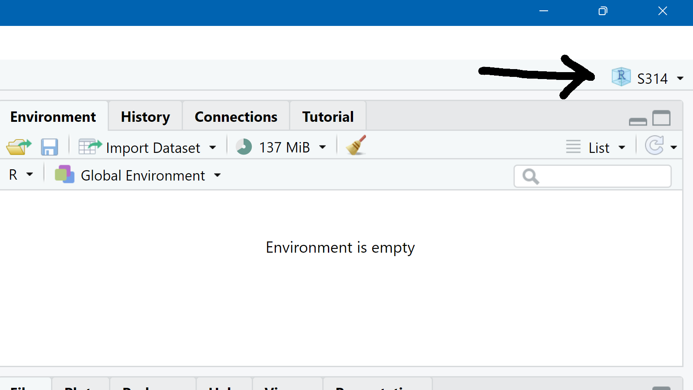
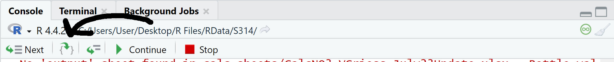
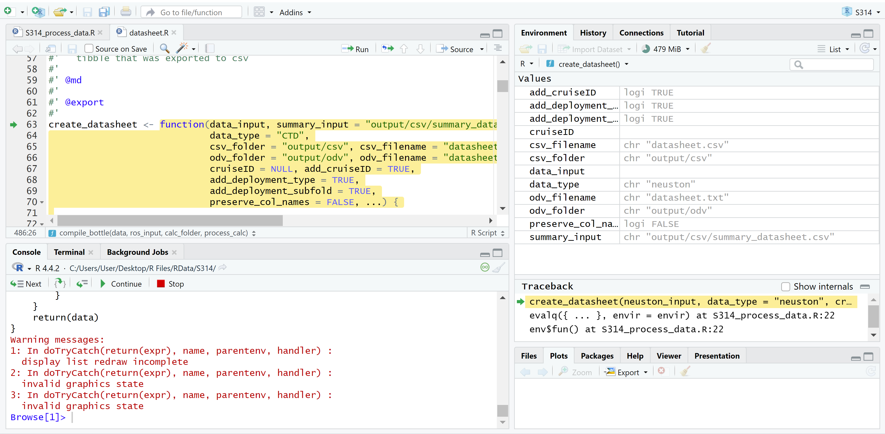

```{r setup, include=FALSE}
knitr::opts_chunk$set(echo = TRUE)
library(seaprocess)
```

# Troubleshooting

This is intended to be the first step for troubleshooting issues that
come up with SeaProcess. Please still communicate with shore support
when issues arise so we can track recurring issues.

## First Steps

### Ensure you are working in your Cruise Project

If you are not working within your crusie project, the pre-defined file
paths will not find the correct files. In the top right corner of your
screen you should see a box with an "R" in it with your cruise number
next to it.

{width="351"}

### Find the Problem Line

If you are running the whole script, stop and try running only the lines
you need For example, for the neuston datasheet, run everything above
`# Process non-datasheet sources----` and then run only:

```{r eval=FALSE}
 # Create Summary datasheet
create_summary(summary_input, elg_folder, cruiseID = cruiseID)

 # Neuston datasheet
create_datasheet(neuston_input, data_type = "neuston",
                 cruiseID = cruiseID)

```

### Double Check File Paths/arguments

Once you have identified the problem line, double check ALL arguments in
that line to make sure they are spelled correctly and are pointing to
the correct file.

Paths to specific files should also include the file extension.
"S314_neuston_input" will throw an error while "S314_neuston_input.xls"
will not.

If you are working in your Cruise Project, R will assume that all file
paths start within your cruise folder until told otherwise. Paths to
datasheets will look like: "datasheets/S314_neuston_input.xls" Paths to
things outside of your cruise project will need to start with a drive
letter. "C:/", Y:/" etc.

### Double Check Your Data Entry

Most errors will crop up here. R is very picky with formatting. Things
to check: - Are all dates and times using the exact same formatting?

-   Are all data types formatted as "text" in the input excel sheet?

-   Are any rows missing data that needs to be filled in?

-   Were extra rows created by accident that R is reading in as blank?

-   Do the station summary and datasheet match?

If you have questions about data entry or formatting see [Using Sea
Process](Using_Seaprocess.html), ask your 1st Marine Tech, or shoot a
quick email to the office!

### Double Check Again!

Before moving on to other steps double check your file paths and data
entry once more!

## Second Steps

This is the point to reach out to the office for support. An early email
**with a copy of your RData folder attached** (as bandwidth allows) can
save you many hours of sleep!

### Debug Your Problem Line

If the problem is not resolved on the users side, we can take a couple
different paths to look at what is happening "under the hood" with
SeaProcess.

#### Comment out Unneeded Lines

To access debugging in Rstudio we need to "source" or run the entire
script at once. However, if Rstudio encounters an error it will stop
processing and might never make it to your problem line. To avoid this
"comment out" any unneeded lines containing functions by putting a `#`
infront of them.

#### Place a Breakpoint

Once you have commented out your script as needed, click next to your
problem line to create a breakpoint. You should see a red dot appear.

{width="439"}

Once your breakpoint is set, save your changes and click "Source."

#### Stepping Through Code

Once your script reaches the breakpoint, your console will show a bar
with debugging controls. Hover over each for a brief description of what
they do.

{width="504"}

First, click on the button to "step into the current function call."
This will take you to the code the function is executing behind the
scenes. Use the "Next" button to step line by line through the code to
find where the error occurs.

Highlighted lines will show what will be run next. Keep a careful eye on
the "Environment" tab in the upper right. This is where you can see
intermediate datasheets or places where a variable may have accidentally
ended up as "NA" or "NULL".

{width="445"}

**NOTE:** SeaProcess has many functions nested within functions. You may
have to "Step Into" other functions to fine the problem.

**NOTE NOTE:** Once processing shows an error debugging will stop and
you will be kicked out to the process_data script and need to restart.
That is okay! You may have to repeat this process a couple of times to
find exactly where the error is occurring.

You will not be able to make any changes to the code here so don't worry
about breaking anything. This is only used to find the problem area.

### Debugging in Source Package

If you identify the problem and it can't be fixed from the typical user
side, we have an option to go into the original code and edit it.

If you have not reached out to shore support by this point, **STOP and
do that first.** Okay, now continue.

On LabUtil there should be a "source" version of the SeaProcess package
stored in CC or RCS science under "Seaprocess .zip files." Find the most
recent folder This is the same code as the package we use when we run
`library(seaprocess)` except in a more readable and editable form.

To access this package, replace the line `library(seaprocess)` with:

```{r, eval = FALSE}
devtools::load_all("<path-to-seaprocess>")
```

On RCS this might be *similar* to:

```{r, eval = FALSE}
devtools::load_all("C:/Users/LabUtil/Desktop/RCS Science 24/RCS Science/Scientist Resources/Computers/R/SeaProcess .zip files/2024-11-18/seaprocess-master")
```

Then, follow the same steps to set breakpoints and step through the code
as above. Because this code is editable you have the option to set
"browser()" anywhere in the background code to pause the script. This
can be helpful to mark a spot to stop at instead of having to step
through many lines of code each time.

If you do place a `browser()` remember to save your work, and run
`devtools::load_all(...)` again to include the change.

Be careful to not make unintentional changes and document ALL changes
you do make. It is important that we have a record of how our data is
processed, as well as a record of bug fixes for future improvements.

# Common Error Messages

Below are some error messages that may pop up and possible fixes. If you
notice some that are not on the list, include them in your eoc so we can
expand this list!

**Message:** "File path is not accessible..."

**Fix:** The file R is trying to write to might be open. Ensure it is
closed and try again.

**Message:** "Error in `dplyr::rows_patch()` at seaprocess/R/calcsheet.R:203:3:                  
! Can't convert from `y$no3` \<double\> to `x$no3` \<logical\> due to loss of precision."

**Fix:** When a column shows up as *logical* it often means that the column is all "NAs." A quick fix for this is to put a "0" in a cell that would otherwise be blank. Let the office know you are having this problem and they can edit how the datasheet is read into R. 

**Message:** "Error in utils::unzip(zip_path, list = TRUE) : 
  zip file 'C:/~$CalcNO3_VGriess_July23Update - Copy.xlsx' cannot be opened"
  
  **Fix:** The file name with a tilde is a temporary file that may not be visible. Close the file it is referring to and run the script again. 
  
# Common Warning Messages

Make sure to note the warning messages that show up, but remember that most of the time they can be safely ignored. 

**Message:** "Warning messages:
Unknown or uninitialised column: `station`. "

**Description:** This message shows up when the odv formatting function couldn't find the column described. Think about whether that column is needed in your data. For example: we don't track stations in our ADCP data so this warning can be ignored for ADCP data. For HC data, you may see SeaProcess show a warning about CDOM or beam_atten (beam attenuation). If you don't have the CDOM or Xmiss attached to the ctd, it can be safely ignored. 

**Message:** "In read.adp.rdi(file, encoding = encoding, processingLog = processingLog..."

**Description:** This message has a couple of variants and will occur during all adcp processing. The warnings do not affect the data output and can be safely ignored. 

