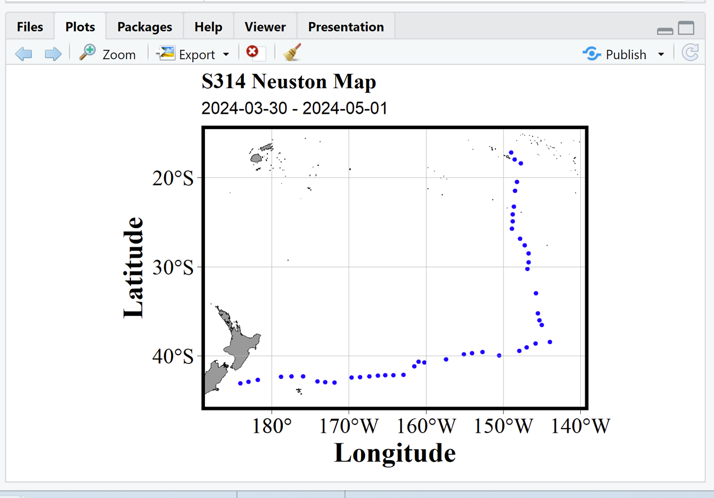
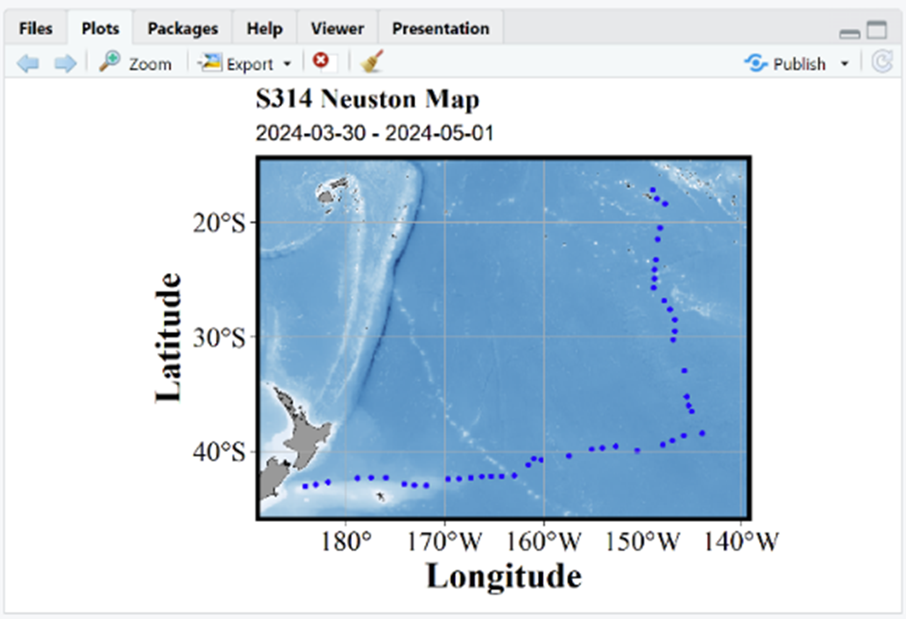
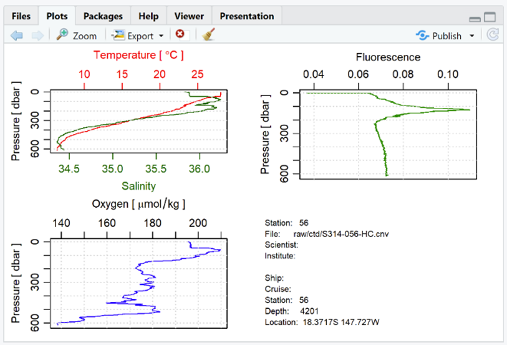
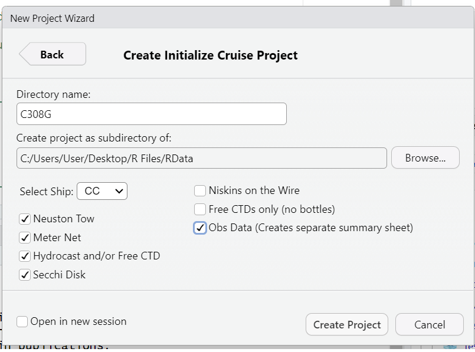

```{r setup, include = FALSE}
knitr::opts_chunk$set(
  collapse = TRUE,
  comment = "#>"
)
```

# Major Updates:

## Expanded Documentation and Units

-   **Introduction to SeaProcess** - Background information on what is happening behind the scenes as the data is processed.
-   **Setup and EOC** - Information for 2nd Marine Techs to setup a new cruise and process data upon EOC.
-   **Using SeaProcess** - Information on data entry and daily use, aimed at 3rd MTs or those unfamiliar with the process.
-   **Troubleshooting** - Basic troubleshooting steps for common errors

All this information is stored within the package as vignettes linked to one another.

## Added Units to Variables

-   Seaprocess will take column names and turn them into “R Friendly” units across all our datasheets. There is an option to toggle this *off* and preserve original column names. More detailed information in [“Setup and EOC"](Setup_and_EOC_SeaProcess.html)

## Updated wire logging to be in alignment with UNOLS requirements

Incorporated processing of raw tension files to track max tension and payout at time of max tension (required by UNOLS Appendix A).
This happens automatically on Seamans.
On CC, as long as Marine Techs create the same tension files using teraterm, Seaprocess can read these and create the same output.

## Improved Customization

-   Incorporated ability to preserve column names on custom datasheets.
    (see `?create_datasheet()`

-   Created a folder of R scripts that will create station plots for all deployments [(Figures 1 and 2).

-   Added an option to view ctd profiles as they are processing to catch errors (Figure 3).

-   Updated calculation sheet processing to be able to autopopulate calculation sheet data from niskins on the wire or reef samples.

-   Added a function to associate profile data with water chemistry values from niskins on the wire based on a user assigned depth and station number.

-   Expanded the “Initialize Cruise…” Wizard so users can customize the process data script without needing to edit it by hand (Figure 4).

-   Added option to customize which variables are pulled from the elg file for deployment metadata (see [Setup and EOC](Setup_and_EOC.html) "Station Summary Sheet") for more information.

    -   Eg. Can automatically append xmiss data or wind speed from the elg to all datasheets if desired

## Figures

{width="284"}

{width="293"}

{width="284"}

{width="293"}

# Additional Updates

-   Within ctd processing, updated density labels to instead be potential density (sigma vs sigma-theta).

    -   This aligned the calculations in the package with the variables output by SBE Data Processing

-   For ODV outputs of the profiling transmissometer, changed “Transmittance” to “Beam Attenuation” so it matches the data coming out of SBE Data Processing

-   Created a "session_info.R" script in the eoc folder that, if run at EOC will save a text file with information on package version numbers when the script was last run.
    -   This will allow future scientists a way to track exactly how the data was processed.
